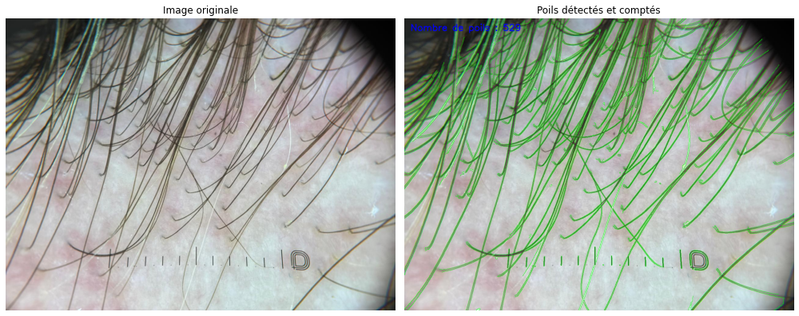

#  Automatic Hair Counting in an Image using OpenCV

This project uses OpenCV and Python to automatically detect and estimate the number of hairs visible in a given image.  
The script displays side-by-side the original image and the annotated image with detected hairs and the total estimated count.

---
## Code Description

The script performs the following steps:  
1. Loads the image from a specified path.  
2. Converts the image to grayscale for simplified processing.  
3. Applies Gaussian blur to reduce noise.  
4. Detects edges using the Canny algorithm to identify hairs (thin and contrasted areas).  
5. Filters contours by their length to remove small noise.  
6. Draws the selected contours on a copy of the original image.  
7. Displays the number of detected hairs directly on the annotated image.  
8. Shows side-by-side the original image and the annotated image.
## Requirements

- Python 3.12  
- Required Python libraries:  
  - `opencv-python`  
  - `numpy`  
  - `matplotlib`
  
## Example Result
Below is an example of the output generated

